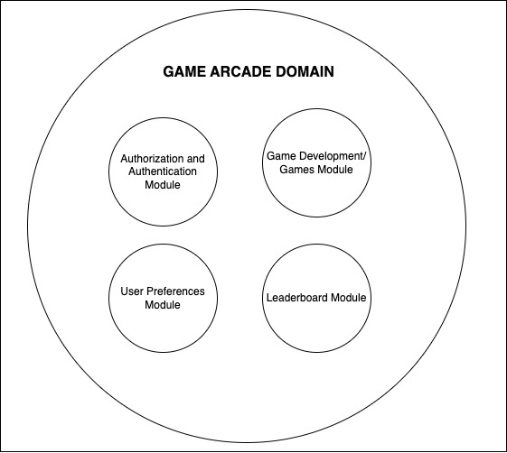
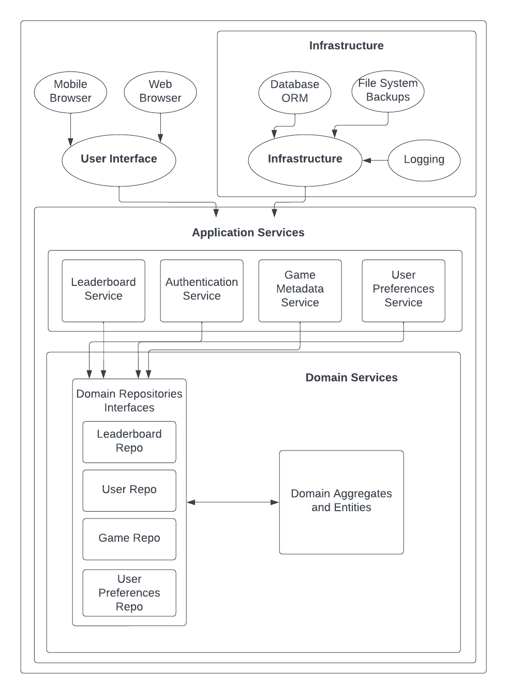

# ArcadeMania

-----------------------------------------------------------------------------------------------------------------

## Team Members

1. Mayur Prabhakar Sangale    (sangale.m@northeastern.edu)
2. Harika Ramidi    (ramidi.h@northeastern.edu)
3. Divya Kharche     (kharche.d@northeastern.edu)
4. Marlapati Venkata Naga Sai Teja (marlapati.v@northeastern.edu)

-----------------------------------------------------------------------------------------------------------------

## Project Description

* The idea is to develop a website with multiple games which will allow user to select and play games according to their choice.
* Different types of games will be available on the portal.
* User will have to signup & login to play the games.
* Scores for each game will be stored & we will maintain a Leaderboard displaying user performace across the games.
* User can also add games to favourites so that upon login favourites will be displayed first.
* User can view the recently played games as well.

-----------------------------------------------------------------------------------------------------------------

## Features

1. Login
2. Sign Up
3. Games
4. Leaderboard
5. Favourites
6. Recently viewed
7. Most liked games

-----------------------------------------------------------------------------------------------------------------

## Domain Diagram

-----------------------------------------------------------------------------------------------------------------

## Component Diagram

-----------------------------------------------------------------------------------------------------------------

## Class diagram

-----------------------------------------------------------------------------------------------------------------

## User Stories

### Admin

1. As an admin I should be able to view the users
    * Go to Homepage click on Login
    * Enter admin credentials
    * Navigate to users page
    * Select a user and click on view

2. As an admin I should be able to delete the users
    * Go to Homepage click on Login
    * Enter admin credentials
    * Navigate to users page
    * Select a user and click on delete

### User

1. As a user I should be able to Signup
    * Navigate to Arcademania website, click on Login button
    * Click on signup tab in the login popup
    * Enter user details
    * Captcha for signup (future scope)
    * Click on signup button
    * Email verification (future scope)
    * Popup should close and the homepage should be updated to the loggedIn state

2. As a user I should be able to login
    * Navigate to Arcademania website, click on Login button
    * Enter user name and password
    * Click on login button
    * Popup should close and the homepage should be updated to the loggedIn state

3. As a user I should be able to select a game
    * Login to the website
    * View the games
    * Select a game
    * game will be opened in a container on the top left corner
    * leaderboard specific to the game will be rendered beside the game container towards the right
    * Recently played games will be displayed on the bottom of the game container

4. As a user I should be able to ask help in a game
    * Login to the website
    * View the games
    * Select a game
    * game will be opened in a container on the top left corner
    * user can see the help button in bottom
    * Click on help button & it will direct to the help page

5. As a user I should be able to play a game
    * Login to the website
    * View the games
    * Select a game
    * game will be opened in a container on the top left corner
    * Click play button to start the game (depends on the game)

6. As a user I should be able to mark a game as favourite
    * Login to the website
    * View the games
    * Select a game
    * game will be opened in a container on the top left corner
    * Add to Favourites button will be available on top right corner click on it

7. As a user I should be able to remove the games from favourites
    * Login to the website
    * Open your favourites page
    * Click on delete button beside the game
    * Game should be removed from the favourites

8. As a user I should be able to check the leaderboard for a specific game
    * Login to the website
    * Select a game
    * View the leaderboard beside the game container

9. As a user I should be able to update my profile
    * Login to the website
    * Click on the MyProfile on top right corner of the website
    * User should be navigated to the profile page
    * User should be able to change the data in the fields like name, age, password and confirm password
    * Click on save
    * Profile data should be updated and displayed the updated content on reload

10. As a user I should be able to view recently played games on left pane
    * Login to the website
    * Expand the left pane
    * View recently played games section with the 3 most recently played games

11. As a user I should be able to view My favourite games on left pane
    * Login to the website
    * Expand the left pane
    * View the favourite games section with 3 favourite games

12. As a user I should be able to navigate to favourites page from left pane
    * Login to the website
    * Expand the left pane
    * click on the the favourite games section header
    * User should be navigated to the favourites page

13. As a user I should be able to view the global leaderboard
    * Login to the website
    * click on the leaderboard
    * global leaderboard should be visible on a right pane which slides in immediately after the click is performed

14. As a user I should be able to see Most liked/Played games
    * Login to the website
    * On the Homepage, there should be a section which will have most played games

### Other Stories

1. Develop Car Crash game
2. Develop Tic-tac-toe game
3. Develop Memory card game
4. Develop Connect4 game
5. Develop Minesweeper game

-----------------------------------------------------------------------------------------------------------------

## Games

1. Car Crash
2. Tic-tac-toe
3. Memory card
4. Connect4
5. Minesweeper

-----------------------------------------------------------------------------------------------------------------

## Future scope

* Add Profile picture for a user
* Email validation on signup
* Captcha validation while signing up and login
* Difficulty level for the games
* Search a game
* More games to be added to the website
* Add and delete games for admin

-----------------------------------------------------------------------------------------------------------------

## References

1. <https://nextjs.org/docs>
2. <https://www.webtips.dev/javascript-game-ideas>
3. <https://www.mirkosertic.de/blog/2013/04/domain-driven-design-example>

-----------------------------------------------------------------------------------------------------------------
